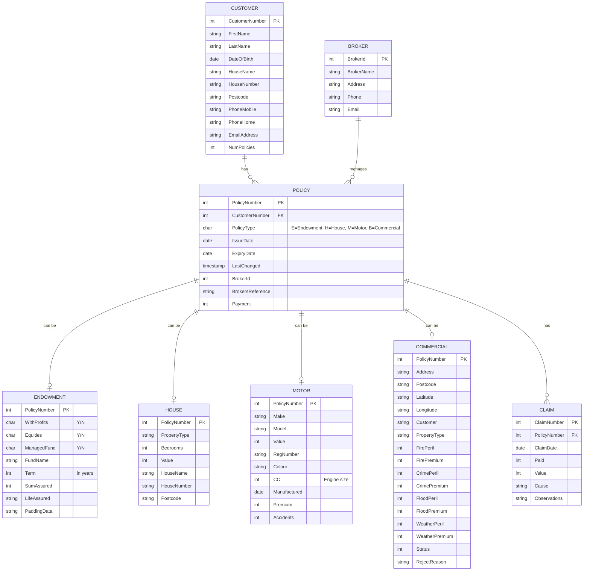

# GenApp Datenmodell

Das folgende Diagramm zeigt das Datenmodell der GenApp-Anwendung basierend auf der Analyse der COBOL-Programme und Datenstrukturen.

## ER-Diagramm

## Tabellenbeschreibungen

### CUSTOMER
Eine Tabelle für alle Kundeninformationen der Versicherungsgesellschaft.

### POLICY
Die zentrale Policentabelle, die alle Arten von Versicherungspolicen verwaltet und eine 1:1-Beziehung zu den speziellen Policentabellen (ENDOWMENT, HOUSE, MOTOR, COMMERCIAL) hat. Jede Police gehört zu genau einem Kunden.

### ENDOWMENT
Enthält spezifische Daten für Kapitallebensversicherungspolicen.

### HOUSE
Enthält spezifische Daten für Wohngebäudeversicherungspolicen.

### MOTOR
Enthält spezifische Daten für Kfz-Versicherungspolicen.

### COMMERCIAL
Enthält spezifische Daten für Gewerbeversicherungspolicen, einschließlich verschiedener Risiken und Prämien.

### CLAIM
Speichert Informationen zu Schadensfällen, die mit einer bestimmten Police verbunden sind.

### BROKER
Informationen über die Versicherungsmakler, die Policen vermitteln.

## Datentypen und Beziehungen

- Ein **Kunde** (CUSTOMER) kann mehrere **Policen** haben.
- Jede **Police** (POLICY) gehört genau zu einem **Kunden**.
- Eine **Police** ist einem der vier Typen zugeordnet: **Kapitallebensversicherung** (ENDOWMENT), **Wohngebäudeversicherung** (HOUSE), **Kfz-Versicherung** (MOTOR) oder **Gewerbeversicherung** (COMMERCIAL).
- Zu einer **Police** können mehrere **Schadenfälle** (CLAIM) erfasst werden.
- Ein **Makler** (BROKER) kann mehrere **Policen** betreuen.
