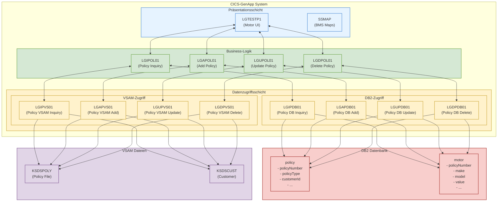

# KFZ-Police (Motor Policy) C4 Komponentendiagramm

Dieses Dokument stellt die KFZ-Police (Motor Policy) im CICS-GenApp System als C4 Komponentendiagramm dar.

## C4 Komponentendiagramm der KFZ-Police

## Komponentenbeschreibung

### Präsentationsschicht
- **LGTESTP1** (Motor Policy UI): Hauptprogramm für die Benutzeroberfläche der KFZ-Police
  - Stellt Optionen für Hinzufügen, Ändern, Löschen und Anzeigen von KFZ-Policen bereit
  - Sammelt Benutzereingaben und ruft die entsprechenden Business-Logik-Funktionen auf
  - Zeigt Ergebnisse und Fehlermeldungen an
- **SSMAP**: BMS-Maps für die Terminal-Benutzeroberfläche

### Business-Logik
- **LGIPOL01** (Inquire Policy): Steuert die Abfrage von KFZ-Policen
- **LGAPOL01** (Add Policy): Steuert das Hinzufügen neuer KFZ-Policen
- **LGUPOL01** (Update Policy): Steuert die Aktualisierung von KFZ-Policen
- **LGDPOL01** (Delete Policy): Steuert das Löschen von KFZ-Policen

Jedes dieser Programme validiert die Eingabedaten, koordiniert den Datenbankzugriff und stellt sicher, dass die Geschäftsregeln eingehalten werden.

### Datenzugriffsschicht
- **DB2-Zugriff**:
  - **LGIPDB01**: Ruft KFZ-Policendaten aus der DB2-Datenbank ab
  - **LGAPDB01**: Fügt neue KFZ-Policen in die DB2-Datenbank ein
  - **LGUPDB01**: Aktualisiert KFZ-Policen in der DB2-Datenbank
  - **LGDPDB01**: Löscht KFZ-Policen aus der DB2-Datenbank

- **VSAM-Zugriff**:
  - **LGIPVS01**: Ruft KFZ-Policendaten aus VSAM-Dateien ab
  - **LGAPVS01**: Fügt neue KFZ-Policen in VSAM-Dateien ein
  - **LGUPVS01**: Aktualisiert KFZ-Policen in VSAM-Dateien
  - **LGDPVS01**: Löscht KFZ-Policen aus VSAM-Dateien

### Externe Systeme
- **DB2 Datenbank**: Persistiert KFZ-Policendaten in relationalen Tabellen
  - **policy**: Allgemeine Policen-Informationen, mit policyType 'M' für KFZ-Policen
  - **motor**: KFZ-spezifische Informationen (mit Fremdschlüssel auf policy.policyNumber)

- **VSAM Dateien**: Speichert Policen- und Kundendaten für schnellen Zugriff
  - **KSDSPOLY**: Speichert Policendaten mit einem Schlüssel, der mit 'M' beginnt für KFZ-Policen
  - **KSDSCUST**: Speichert Kundendaten

## Schlüsselinteraktionen

1. **Abfrage einer KFZ-Police**:
   - LGTESTP1 sammelt die Kunden- und Policennummer
   - Ruft LGIPOL01 über CICS LINK auf
   - LGIPOL01 ruft LGIPDB01 auf, um DB2-Daten abzufragen
   - LGIPDB01 führt einen SQL-JOIN zwischen policy und motor-Tabellen aus
   - Ergebnisse werden zurück an die Benutzeroberfläche weitergeleitet

2. **Hinzufügen einer KFZ-Police**:
   - LGTESTP1 sammelt alle KFZ-Policendetails
   - Ruft LGAPOL01 über CICS LINK auf
   - LGAPOL01 ruft LGAPDB01 auf, um die Daten in DB2 zu speichern
   - LGAPDB01 führt INSERT-Operationen in die policy- und motor-Tabellen aus
   - LGAPOL01 ruft LGAPVS01 auf, um Daten in VSAM zu speichern
   - Bestätigung wird zurück an die Benutzeroberfläche weitergeleitet

3. **Aktualisieren einer KFZ-Police**:
   - LGTESTP1 sammelt die geänderten KFZ-Policendaten
   - Ruft LGUPOL01 über CICS LINK auf
   - LGUPOL01 ruft LGUPDB01 auf, um die Daten in DB2 zu aktualisieren
   - LGUPDB01 führt UPDATE-Operationen in der policy- und motor-Tabellen aus
   - LGUPOL01 ruft LGUPVS01 auf, um Daten in VSAM zu aktualisieren
   - Bestätigung wird zurück an die Benutzeroberfläche weitergeleitet

4. **Löschen einer KFZ-Police**:
   - LGTESTP1 sammelt die Kunden- und Policennummer
   - Ruft LGDPOL01 über CICS LINK auf
   - LGDPOL01 ruft LGDPDB01 auf, um die Daten aus DB2 zu löschen
   - LGDPDB01 führt DELETE-Operationen in der policy-Tabelle aus (mit CASCADE-DELETE für motor)
   - LGDPOL01 ruft LGDPVS01 auf, um Daten aus VSAM zu löschen
   - Bestätigung wird zurück an die Benutzeroberfläche weitergeleitet
