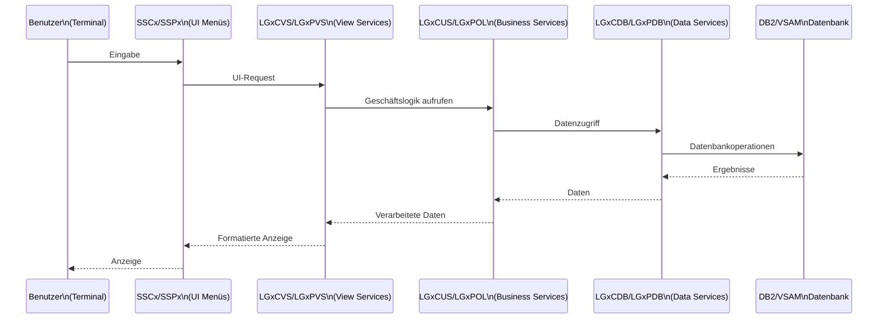
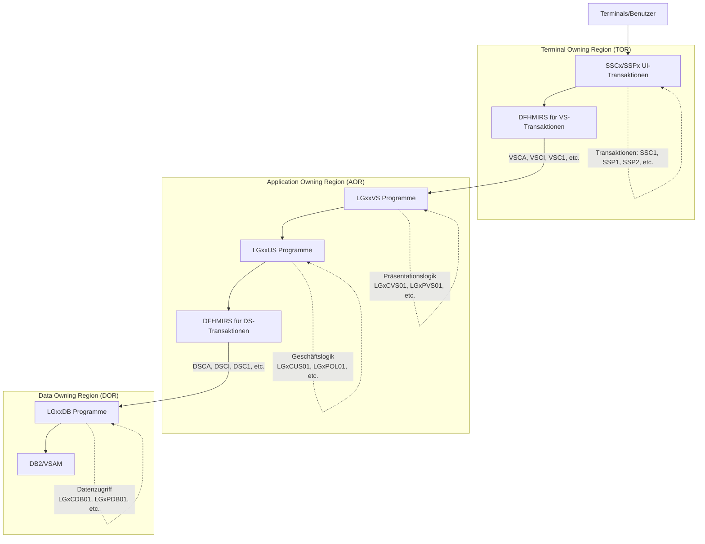

# Transaktionsübersicht im CICS-GenApp System

- [Einführung](#einführung)
- [Übersicht der Transaktionstypen](#übersicht-der-transaktionstypen)
- [Haupttransaktionen](#haupttransaktionen)
  - [Benutzeroberflächen (UI) Transaktionen](#benutzeroberflächen-ui-transaktionen)
  - [Geschäftslogik-Transaktionen](#geschäftslogik-transaktionen)
  - [Verwaltungs-Transaktionen](#verwaltungs-transaktionen)
- [CICS-Routing-Transaktionen](#cics-routing-transaktionen)
  - [Terminal zu Application Owning Region](#terminal-zu-application-owning-region)
  - [Application zu Data Owning Region](#application-zu-data-owning-region)
- [Transaktions-Namenskonventionen](#transaktions-namenskonventionen)
- [Programmfunktionen](#programmfunktionen)
- [CICS-Ressourcen im System](#cics-ressourcen-im-system)
  - [Dateien](#dateien)
  - [Gruppen und Listen](#gruppen-und-listen)
- [Datenfluss zwischen Transaktionen](#datenfluss-zwischen-transaktionen)
- [Regionsarchitektur](#regionsarchitektur)
- [Statistik und Monitoring-Transaktionen](#statistik-und-monitoring-transaktionen)
- [Zusammenfassung](#zusammenfassung)

## Einführung

Die GenApp-Anwendung ist ein CICS-basiertes Versicherungssystem, das mehrere Transaktionen für verschiedene Funktionen verwendet. Dieses Dokument bietet einen Überblick über die Transaktionen, die im System identifiziert wurden, ihre Zuordnung zu Programmen und ihre Funktion im Geschäftskontext.

## Übersicht der Transaktionstypen

Die Transaktionen im GenApp-System können in folgende Hauptkategorien unterteilt werden:

| Kategorie | Beschreibung |
|-----------|-------------|
| Benutzeroberflächen-Transaktionen | Transaktionen mit Präfix "SS" (SSC1, SSP1, etc.), die Menübildschirme und Benutzerinteraktion bereitstellen |
| Geschäftslogik-Transaktionen | Transaktionen mit Präfix "LG" (LGCF, LGPF), die Kernfunktionen der Geschäftsanwendung ausführen |
| Verwaltungs-Transaktionen | Transaktionen wie LGSE und LGST, die für Systemverwaltung und -überwachung verwendet werden |
| Routing-Transaktionen | Transaktionen mit Präfix "DS" und "VS", die für die CICS-Regionsverbindung (TOR-AOR-DOR) verwendet werden |

## Haupttransaktionen

### Benutzeroberflächen (UI) Transaktionen

| Transaktion | Programm | Funktion |
|-------------|----------|----------|
| SSC1 | LGTESTC1 | Kunden-Menü (Customer Menu) |
| SSP1 | LGTESTP1 | Kfz-Policen-Menü (Motor Policy Menu) |
| SSP2 | LGTESTP2 | Hausrat-Policen-Menü (House Policy Menu) |
| SSP3 | LGTESTP3 | Gebäude-Policen-Menü (House Policy Menu) |
| SSP4 | LGTESTP4 | Weiteres Policen-Menü |

### Geschäftslogik-Transaktionen

| Transaktion | Programm | Funktion |
|-------------|----------|----------|
| LGCF | LGICVS01 | Kundenabfrage (Customer Inquiry) |
| LGPF | LGIPVS01 | Policenabfrage (Policy Inquiry) |

### Verwaltungs-Transaktionen

| Transaktion | Programm | Funktion |
|-------------|----------|----------|
| LGSE | LGSETUP | Initialisierung von TS-Queues und Counter |
| LGST | LGASTAT1 | Statistik-Funktionen für Business Events |
| SSST | LGWEBST5 | Erfassung von Counter-Werten für Statistik |

## CICS-Routing-Transaktionen

Das System nutzt eine TOR-AOR-DOR-Architektur (Terminal Owning Region, Application Owning Region, Data Owning Region) mit speziellen Routing-Transaktionen.

### Terminal zu Application Owning Region

| Transaktion | Programm | Funktion |
|-------------|----------|----------|
| VSCA | DFHMIRS | CICS Mirror Transaction für LGACVS01 |
| VSCI | DFHMIRS | CICS Mirror Transaction für LGICVS01 |
| VSC1 | DFHMIRS | CICS Mirror Transaction für LGUCVS01 |
| VSPA | DFHMIRS | CICS Mirror Transaction für LGAPVS01 |
| VSPD | DFHMIRS | CICS Mirror Transaction für LGDPVS01 |
| VSPI | DFHMIRS | CICS Mirror Transaction für LGIPVS01 |
| VSP1 | DFHMIRS | CICS Mirror Transaction für LGUPVS01 |

### Application zu Data Owning Region

| Transaktion | Programm | Funktion |
|-------------|----------|----------|
| DSCA | DFHMIRS | CICS Mirror Transaction für LGACDB01 |
| DSCI | DFHMIRS | CICS Mirror Transaction für LGICDB01 |
| DSC1 | DFHMIRS | CICS Mirror Transaction für LGUCDB01 |
| DSPA | DFHMIRS | CICS Mirror Transaction für LGAPDB01 |
| DSPD | DFHMIRS | CICS Mirror Transaction für LGDPDB01 |
| DSPI | DFHMIRS | CICS Mirror Transaction für LGIPDB01 |
| DSP1 | DFHMIRS | CICS Mirror Transaction für LGUPDB01 |

## Transaktions-Namenskonventionen

Die Transaktionsnamen im GenApp-System folgen bestimmten Konventionen:

| Präfix | Bedeutung |
|--------|-----------|
| SS | Solution Services - Benutzeroberflächen-Transaktionen |
| LG | Logic - Geschäftslogik-Transaktionen |
| DS | Data Services - Transaktionen zur Datenbankanbindung |
| VS | View Services - Transaktionen zur Präsentationsschicht |

## Programmfunktionen

Die Programme im System folgen ebenfalls einer klaren Namenskonvention:

| Position | Code | Bedeutung |
|----------|------|-----------|
| Position 3 | A | Hinzufügen (Add) |
| | I | Abfragen (Inquire) |
| | D | Löschen (Delete) |
| | U | Aktualisieren (Update) |
| Position 4 | C | Kunde (Customer) |
| | P | Police (Policy) |
| Position 5 | DB | Datenbankzugriff |
| | VS | Sicht/Präsentation |
| | US | Geschäftslogik |

Beispiel: `LGICDB01` = Logic + Inquire + Customer + Database + Version 01

## CICS-Ressourcen im System

### Dateien

| Datei | Funktion |
|-------|----------|
| KSDSCUST | Kundendaten (Customer Data) |
| KSDSPOLY | Policendaten (Policy Data) |

### Gruppen und Listen

| Resource | Beschreibung |
|----------|-------------|
| GENASAT, GENATORT | Transaktionsdefinitionen |
| GENASAP, GENATORP, GENAAORP, GENADORP | Programmdefinitionen |
| GENASAD, GENADORD | DB2-Verbindungen |
| GENASAF, GENA | Dateidefinitionen |
| GENAWSRV | Webservice-Definitionen |
| GENAEVNT | Ereignisverarbeitung |

## Datenfluss zwischen Transaktionen

## Regionsarchitektur

Die GenApp-Anwendung verwendet eine klassische CICS-Regionsarchitektur mit drei Ebenen:

## Statistik und Monitoring-Transaktionen

Das GenApp-System enthält spezielle Transaktionen und Programme für Statistik und Monitoring:

| Komponente | Zweck | Details |
|-----------|-------|---------|
| LGASTAT1 (LGST) | Erfassung von Transaktionsstatistiken | Sammelt Informationen über Transaktionsaufrufe |
| LGWEBST5 (SSST) | Web-Statistik | Sammelt Zähler für Webdienst-Statistiken |
| Counter- und TS-Queues | Speicherung von Statistikdaten | Zähler für verschiedene Transaktionsarten: Anfragen, Hinzufügen, Aktualisieren, Löschen |

## Zusammenfassung

Die GenApp-Anwendung verwendet eine gut strukturierte Sammlung von CICS-Transaktionen und -Programmen, die einem klaren Benennungsschema folgen. Die Anwendung ist nach einem klassischen Dreischicht-Design mit Präsentationsschicht (VS), Geschäftslogikschicht (US) und Datenzugriffsschicht (DB) aufgebaut, die über entsprechende Transaktionen miteinander kommunizieren.

Die Transaktionen sind nach ihrer Funktion organisiert:
- Benutzerinteraktion (SS-Transaktionen)
- Geschäftslogik (LG-Transaktionen)
- Routing zwischen Regionen (VS- und DS-Transaktionen)
- Systemverwaltung und Statistik (LGSE, LGST, SSST)
